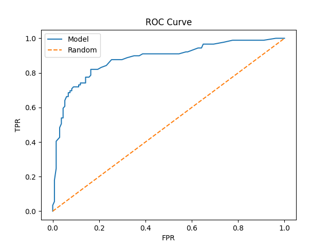

# 🚀 Machine Learning Practice — From Scratch to Scikit-Learn
End-to-end Machine Learning implementations covering algorithms from scratch (NumPy) to production-style pipelines (scikit-learn), including evaluation, ROC-AUC analysis, and cross-validation.


## 🔍 What This Project Covers

* ✅ ML algorithms from scratch (NumPy)
* ✅ Sklearn pipelines for real-world workflows
* ✅ Model comparison (LogReg, KNN, Tree, RF)
* ✅ ROC-AUC and threshold tuning
* ✅ Cross-validation for robust evaluation

## 📂 Project Structure

```
ml-practice/
│
├── data/                  # Datasets
│
├── scratch/               # From-scratch implementations (NumPy)
│   ├── linear_regression_numpy.py
│   ├── logistic_regression_numpy.py
│   ├── knn_numpy.py
│   ├── kmeans_numpy.py
│   └── pca_numpy.py
│
├── sklearn_pipeline/      # Sklearn-based pipelines
│   ├── titanic_pipeline.py
│   ├── iris_models.py
│   ├── house_prices.py
│   └── clustering.py
│
├── utils/                 # Shared utilities
│   ├── preprocessing.py
│   ├── evaluation.py
│   └── visualization.py
│
├── main.py                # Entry point
├── requirements.txt
└── README.md
```

## 📊 Model Comparison (Titanic Dataset)

| Model               | Accuracy | Precision | Recall | F1 Score | AUC    |
| ------------------- | -------- | --------- | ------ | -------- | ------ |
| Logistic Regression | 0.7982   | 0.7619    | 0.7191 | 0.7399   | 0.8751 |
| KNN                 | 0.8251   | 0.7976    | 0.7528 | 0.7746   | 0.8701 |
| Decision Tree       | 0.8117   | 0.7831    | 0.7303 | 0.7558   | 0.8280 |
| Random Forest       | 0.8206   | 0.8000    | 0.7191 | 0.7574   | 0.8698 |

---

### 🧠 Key Insight

* Although **KNN** achieves the highest accuracy,
* **Random Forest** and **Logistic Regression** provide better **overall performance** when considering AUC.
* Final model selection is based on **AUC (robust across thresholds)**.


## 📈 ROC Curve



## ⚙️ Workflow

The machine learning pipeline follows these steps:

1. **Data Loading**

   * Load dataset (Titanic, Iris, etc.)

2. **Preprocessing**

   * Handle missing values
   * Encode categorical variables
   * Feature engineering (e.g., FamilySize, IsAlone)

3. **Train-Test Split**

   * Split dataset into training and testing sets

4. **Feature Scaling**

   * Standardize features for distance-based and linear models

5. **Model Training**

   * Train multiple models:

     * Logistic Regression
     * KNN
     * Decision Tree
     * Random Forest

6. **Evaluation**

   * Accuracy, Precision, Recall, F1 Score
   * ROC Curve and AUC

7. **Model Comparison**

   * Compare models using consistent metrics

8. **Cross-Validation**

   * Validate model stability across multiple data splits

9. **Model Selection**

   * Select best model based on AUC and consistency


## ▶️ How to Run

1. Clone the repository:

```bash
git clone https://github.com/kmusheer/ml-practice.git
cd ml-practice
```

2. Install dependencies:

```bash
pip install -r requirements.txt
```

3. Run the project:

```bash
python main.py
```

4. Switch modes (optional):

* Edit `main.py` and change:

```python
mode = "scratch"  # or "sklearn"
```


## 🧠 Key Learnings

* Implemented ML algorithms from scratch using NumPy
* Built reusable ML pipelines using scikit-learn
* Understood importance of feature scaling
* Compared models using multiple evaluation metrics
* Learned ROC-AUC and threshold tuning
* Applied cross-validation for robust model evaluation

